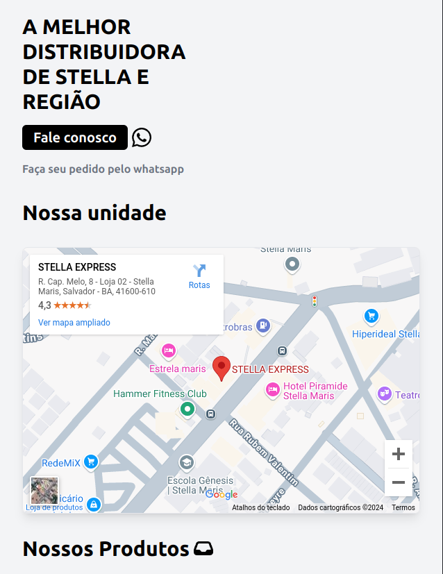

# Stella Express




Este projeto é uma landing page para uma distribuidora de bebidas real, com o objetivo de atrair o usuário para o WhatsApp, mostrando a localização, os produtos e um pouco sobre a empresa.

## Tecnologias Utilizadas

- **React**: Framework para construção da interface de usuário.
- **TypeScript**: Superset do JavaScript que adiciona tipagem estática.
- **Tailwind CSS**: Framework CSS para design responsivo e moderno.

## Funcionalidades

- Exibir os produtos vendidos pela empresa.
- Chamada para ação (CTA) direcionando para o WhatsApp e Instagram.
- Seção sobre a empresa.
  
## Como Rodar o Projeto Localmente

### 1. Clone este repositório
```bash
git clone https://github.com/henriquedevop/stellaExpress.git
```
### 2. Instale as dependências
```bash
cd stellaExpress
npm install

```
### 3. Rode o projeto
```bash
npm run dev
```